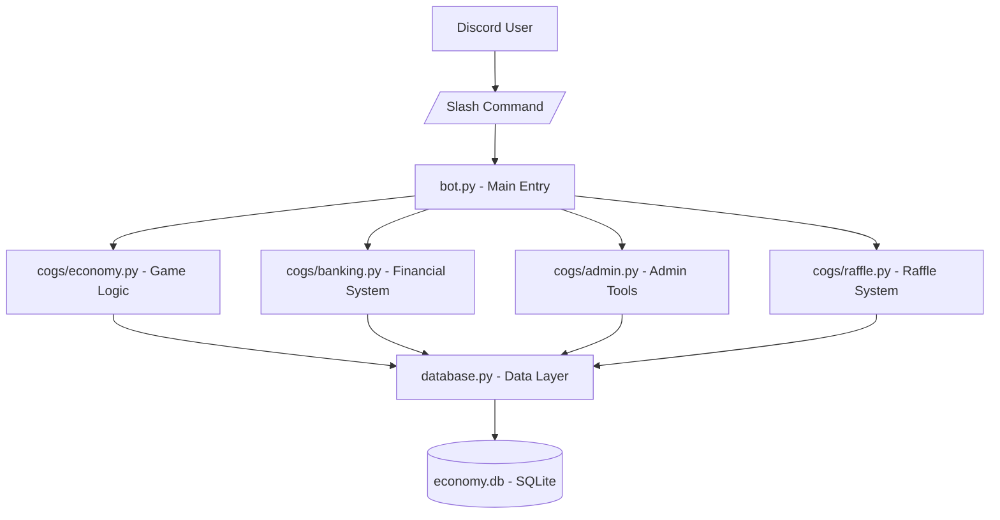

# Discord Economy Bot

A Discord bot implementing an economy system with async Python, SQLite database management, and modular architecture using Discord.py.

## Technical Implementation

### **Concepts Demonstrated**
- **Async/Await Patterns** - Non-blocking I/O operations with Python coroutines
- **Database Design** - SQLite schema design with foreign key relationships and audit logging
- **Modular Architecture** - Separation of concerns using Discord.py cogs and shared data layer
- **Financial Calculations** - Compound interest implementation with time-based accrual
- **Production Practices** - Environment variable configuration and secure token management

## Technical Stack
- **Python 3.8+** with async/await patterns
- **discord.py** for Discord API interaction
- **aiosqlite** for async SQLite operations  
- **SQLite** for data persistence
- **python-dotenv** for configuration management

## Architecture


```mermaid
flowchart TD
    A[Discord User] --> B[/Slash Command/]
    B --> C[bot.py - Main Entry]
    C --> D[cogs/economy.py - Game Logic]
    C --> E[cogs/banking.py - Financial System]
    C --> F[cogs/admin.py - Admin Tools]
    C --> G[cogs/raffle.py - Raffle System]
    
    D --> H[database.py - Data Layer]
    E --> H
    F --> H
    G --> H
    
    H --> I[(economy.db - SQLite)]
```

## Project Structure
```
Economy_Bot/
├── bot.py              # Bot configuration and startup
├── database.py         # Database operations and schema
├── cogs/               # Modular command groups
│   ├── economy.py      # Core economy commands (work, gamble, heist, jailbreak)
│   ├── banking.py      # Banking system with compound interest
│   ├── admin.py        # Administrative utilities
│   └── raffle.py       # Timed raffle system with prize pot
├── adjust_balance.py   # Utility for balance adjustments
├── run_bot.bat         # Windows batch script to run the bot
├── .env.example        # Environment template
└── .gitignore          # Version control exclusions
```

## Database Design
```sql
-- Primary user data
CREATE TABLE users (
    user_id   INTEGER PRIMARY KEY,
    balance   INTEGER DEFAULT 0,
    last_work INTEGER DEFAULT 0,
    jail_until INTEGER DEFAULT 0
)

-- Banking system with compound interest
CREATE TABLE bank_accounts (
    user_id INTEGER PRIMARY KEY,
    bank_balance INTEGER DEFAULT 0,
    interest_rate FLOAT DEFAULT 0.01,
    last_interest_calculation INTEGER DEFAULT 0,
    FOREIGN KEY (user_id) REFERENCES users(user_id)
)

-- Transaction audit trail
CREATE TABLE transaction_log (
    id            INTEGER PRIMARY KEY AUTOINCREMENT,
    user_id       INTEGER NOT NULL,
    action        TEXT    NOT NULL,
    amount        INTEGER NOT NULL,
    balance_after INTEGER NOT NULL,
    time_stamp    TEXT    DEFAULT (datetime('now'))
)
```

## Key Technical Implementation

### Async Database Operations
```python
async def get_balance(user_id: int) -> int:
    async with aiosqlite.connect(DB_PATH) as db:
        async with db.execute(
            "SELECT balance FROM users WHERE user_id = ?", (user_id,)
        ) as cursor:
            row = await cursor.fetchone()
            return row[0] if row else 0
```

### Compound Interest Calculation
```python
async def calculate_interest(user_id: int):
    async with aiosqlite.connect(DB_PATH) as db:
        # Get current balance and last calculation
        async with db.execute(
            "SELECT bank_balance, last_interest_calculation, interest_rate FROM bank_accounts WHERE user_id = ?", (user_id,)
        ) as cursor:
            row = await cursor.fetchone()
            if not row:
                return
            
            bank_balance = row[0] or 0
            last_calc = row[1] or 0
            interest_rate = row[2] or 0.01
        
        now = int(time.time())
        if last_calc > 0:
            days = (now - last_calc) // 86400
        else:
            days = 0
        
        if days > 0 and bank_balance > 0:
            # Compound interest: new_balance = balance * (1 + rate)^days
            new_balance = int(bank_balance * ((1 + interest_rate) ** days))
            await db.execute(
                "UPDATE bank_accounts SET bank_balance = ?, last_interest_calculation = ? WHERE user_id = ?",
                (new_balance, now, user_id)
            )
            await db.commit()
```

### Modular Command System
```python
# bot.py - loading extensions
async def setup_hook(self):
    await database.setup_db()
    await self.load_extension("cogs.economy")
    await self.load_extension("cogs.banking")
    await self.load_extension("cogs.admin")
    await self.tree.sync(guild=MY_GUILD)

# cogs/banking.py - command implementation
@app_commands.command(name="bank_deposit", description="Deposit coins to your bank account")
async def bank_deposit(self, interaction: discord.Interaction, amount: int):
    user_id = interaction.user.id
    if amount <= 0:
        await interaction.response.send_message("Amount must be more than 0.")
        return
    
    wallet_bal = await database.get_balance(user_id)
    if amount > wallet_bal:
        await interaction.response.send_message("You don't have enough coins in your wallet.")
        return
    
    await database.calculate_interest(user_id)
    await database.deposit_to_bank(user_id, amount)
    
    new_wallet = await database.get_balance(user_id)
    new_bank = await database.get_bank_balance(user_id)
    
    await interaction.response.send_message(
        f"Deposited {amount} coins to your bank.\n"
        f"Wallet: {new_wallet} coins\n"
        f"Bank: {new_bank} coins"
    )
```

## Features
- **/work** - Cooldown based work system for economy stimulation
- **/gamba** - Gambling system (50/50 chance to double or lose bet)
- **/heist** - Risk/reward bank robbery (50% success rate)
- **/jailbreak** - Rescue teammates from jail with varying success rates
- **/bank_deposit** - Deposit coins to bank account
- **/bank_withdraw** - Withdraw coins from bank account
- **/bank_interest** - View interest calculation details
- **/raffle_start** - Start a timed raffle with configurable ticket price
- **/raffle_enter** - Buy a ticket for the active raffle
- **/give_player_balance** - Admin balance management
- **/admin_bailout** - Admin jail management

## Raffle System
The raffle system provides a social gambling feature where multiple players can enter a raffle for a shared prize pool:

```python
# Start a raffle that runs for 5 minutes with 100-coin tickets
/raffle_start ticket_price:100 minutes:5

# Players enter the raffle
/raffle_enter

# After the timer expires, a winner is randomly selected
# Winner receives the full prize pot (ticket_price × number_of_entries)
```

Key features:
- **Automatic Timer** - Raffle automatically ends after specified duration
- **Prize Pool** - All entry fees accumulate into a pot won by the randomly selected winner
- **Per-Server Raffles** - Each Discord server maintains its own active raffle
- **Duplicate Prevention** - Only one raffle can be active per server at a time

## Installation
```bash
# Clone repository
git clone https://github.com/yourusername/economy-bot.git
cd economy-bot

# Install dependencies from requirements.txt
pip install -r requirements.txt

# Configure environment
cp .env.example .env
# Edit .env with DISCORD_TOKEN and GUILD_ID

# Run the bot (Windows)
run_bot.bat

# Or run the bot directly (Any OS)
python bot.py
```

## Environment Configuration
```env
DISCORD_TOKEN=your_bot_token
GUILD_ID=your_guild_id
```

## Project Quality

### Error Handling
All database operations include try/except error handling with graceful fallbacks:
- Database errors are logged to console
- Functions return sensible defaults (0 for amounts, None for failures)
- Bot continues running even if individual operations fail

### Dependencies Management
Project uses `requirements.txt` for reproducible installations:
- **discord.py==2.3.2** - Discord API interaction
- **aiosqlite==1.3.0** - Async SQLite database operations
- **python-dotenv==1.0.0** - Environment variable management
