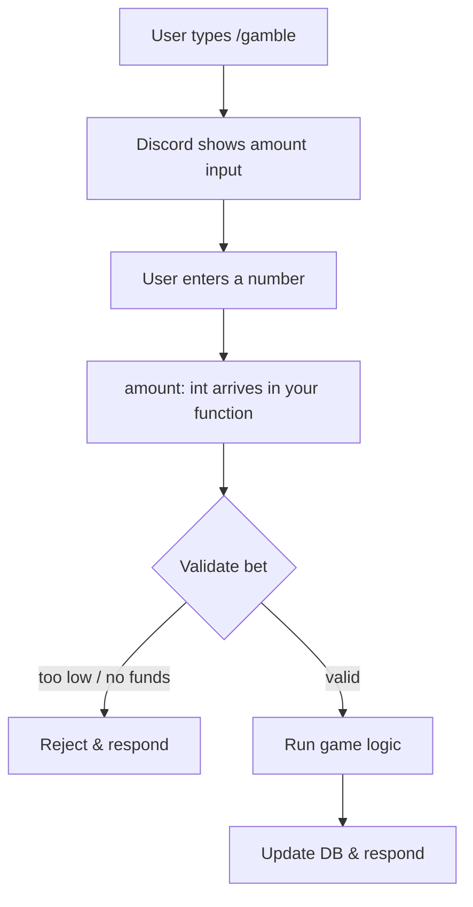

# `app_commands` — Command Parameters

## What You Already Know

`@app_commands.command()` registers a slash command. So far your commands only take `interaction: discord.Interaction` — the default Discord context object. Parameters let users _pass values_ into the command directly from the Discord UI.

---

## Adding a Parameter

```python
@app_commands.command(name="gamble", description="Bet your coins")
async def gamble(self, interaction: discord.Interaction, amount: int):
    ...
```

- Any argument after `interaction` becomes a **slash command option**
- Discord auto-generates the input field in the UI from the type hint
- The name of the argument becomes the option label shown to the user

---

## Type Hints → Discord Input Types

|Python Type|Discord Input|
|---|---|
|`int`|Number (integer)|
|`str`|Text|
|`float`|Number (decimal)|
|`bool`|True/False toggle|
|`discord.Member`|User picker|

For gambling, you want `int`.

---

## Describing a Parameter

Use `app_commands.describe()` to add a hint shown under the input field:

```python
@app_commands.command(name="gamble", description="Bet your coins")
@app_commands.describe(amount="How many coins do you want to bet?")
async def gamble(self, interaction: discord.Interaction, amount: int):
    ...
```

---

## Optional Parameters

Add a default value to make a parameter optional:

```python
async def gamble(self, interaction: discord.Interaction, amount: int = 100):
```

> If the user doesn't provide a value, `amount` falls back to `100`.

---

## Flow Overview



---

## Validation Pattern (your project's style)

```python
bal = await database.get_balance(interaction.user.id)

if amount <= 0:
    await interaction.response.send_message("Bet must be more than 0.")
    return

if amount > bal:
    await interaction.response.send_message("You don't have enough coins.")
    return
```

> Same early-return pattern you used in `/work` for the cooldown check.

---

## Key Points

- Parameters go **after** `interaction`, never before
- Type hints are **required** — Discord uses them to build the UI
- `app_commands.describe()` is optional but good UX practice
- Validation happens inside the function, not at the decorator level