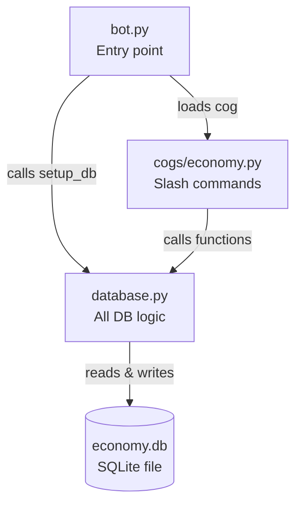
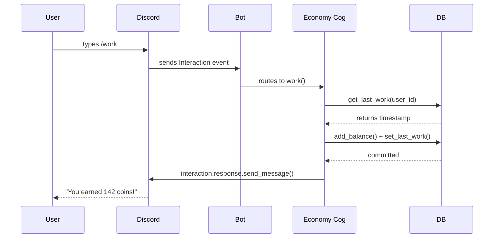

### The Tech Stack

**1. `discord.py`** The Python library that lets you interact with Discord's API. You'll use it for everything — reading messages, slash commands, embeds, etc. The modern version uses **slash commands** via `app_commands`.

**2. `async/await` (Asyncio)** Discord bots are asynchronous — they listen for events without freezing. You already write functions; now they look like `async def` and you `await` things. This is the biggest new concept. Worth researching on its own.

**3. SQLite + `aiosqlite`** SQLite is a lightweight file-based database — no server setup, just a `.db` file. `aiosqlite` is the async version. Perfect for bots. You'll use basic SQL: `CREATE TABLE`, `SELECT`, `INSERT`, `UPDATE`.

**4. SQL Basics** Just 4 commands cover 90% of what you need: `SELECT`, `INSERT`, `UPDATE`, `DELETE`. Very learnable in a day.


> **Stack:** `discord.py` · `aiosqlite` · SQLite · Python asyncio **Files:** `bot.py` → `database.py` → `cogs/economy.py`

---

## How the Files Connect



---

## File 1 — `database.py`

### Imports

```python
import aiosqlite
```

- `aiosqlite` is a wrapper around Python's built-in `sqlite3` module
- The `a` prefix = **async** — it won't freeze the bot while waiting on the database
- Research: _SQLite vs other databases_, _why async matters in bots_

---

### The DB Path Constant

```python
DB_PATH = "economy.db"
```

- A module-level constant (ALL_CAPS by convention) storing the filename
- SQLite databases are just **files** — running the bot creates this file automatically if it doesn't exist
- Every function imports and uses this one variable so you only change the path in one place

---

### `setup_db()`

```python
async def setup_db():
    async with aiosqlite.connect(DB_PATH) as db:
```

- `async def` — this is a **coroutine**, meaning it can pause and let other things run while it waits
- `async with` — like a normal `with` statement but async-safe; automatically closes the DB connection when the block ends
- `aiosqlite.connect(DB_PATH)` — opens (or creates) the `.db` file and returns a connection object called `db`

```python
        await db.execute("""
            CREATE TABLE IF NOT EXISTS users (
                user_id   INTEGER PRIMARY KEY,
                balance   INTEGER DEFAULT 0,
                last_work INTEGER DEFAULT 0
            )
        """)
```

- `await` — pauses here until the DB is done, then continues (you **must** `await` anything from `aiosqlite`)
- `db.execute()` — sends a raw SQL command to the database
- `CREATE TABLE IF NOT EXISTS` — creates the `users` table only if it doesn't already exist; safe to call every startup
- **Columns defined:**

|Column|Type|Meaning|
|---|---|---|
|`user_id`|`INTEGER PRIMARY KEY`|Discord user ID — unique, acts as the row identifier|
|`balance`|`INTEGER DEFAULT 0`|Coin balance, starts at 0|
|`last_work`|`INTEGER DEFAULT 0`|Unix timestamp of last `/work` use|

```python
        await db.commit()
```

- SQL changes aren't permanent until you **commit**
- Think of it like hitting Save — without this, changes are lost when the connection closes
- Rule of thumb: every `INSERT`, `UPDATE`, or `DELETE` needs a `commit()` after

---

### `get_balance()`

```python
async def get_balance(user_id: int) -> int:
```

- `user_id: int` — type hint, not enforced by Python but signals what to pass in
- `-> int` — this function returns an integer (the balance)

```python
    async with aiosqlite.connect(DB_PATH) as db:
        async with db.execute(
            "SELECT balance FROM users WHERE user_id = ?", (user_id,)
        ) as cursor:
```

- `SELECT balance FROM users WHERE user_id = ?` — fetch the `balance` column from the row where `user_id` matches
- `?` — a **placeholder**; never put variables directly in SQL strings (SQL injection risk). Pass values as a tuple instead
- `(user_id,)` — a one-item tuple (the trailing comma makes it a tuple, not just parentheses)
- `cursor` — the object that holds the query results; you read from it next

```python
            row = await cursor.fetchone()
            return row[0] if row else 0
```

- `fetchone()` — grabs the first (and here, only) result row, or `None` if no row was found
- `row[0]` — the first column in the result (`balance`), since `SELECT balance` returned one column
- `if row else 0` — if the user doesn't exist in the DB yet, return `0` instead of crashing

---

### `add_balance()`

```python
async def add_balance(user_id: int, amount: int):
```

- No return type annotation — this function just performs an action, returns nothing (`None`)

```python
        await db.execute(
            "INSERT OR IGNORE INTO users (user_id) VALUES (?)", (user_id,)
        )
```

- `INSERT OR IGNORE` — tries to insert a new row; if a row with that `user_id` already exists, silently does nothing
- This is a safety net — ensures the user exists in the table before you try to update their balance

```python
        await db.execute(
            "UPDATE users SET balance = balance + ? WHERE user_id = ?",
            (amount, user_id)
        )
```

- `SET balance = balance + ?` — reads the current value and adds to it in one SQL operation (atomic, safe)
- Two `?` placeholders → two values in the tuple: `(amount, user_id)` — **order matters**

```python
        await db.commit()
```

- Always commit after writes — same rule as `setup_db()`

---

### `get_last_work()` and `set_last_work()`

> Same patterns as above — these follow the exact same structure as `get_balance` / `add_balance` but for the `last_work` column. Re-read those explanations and they apply here.

**One thing to note:**

```python
async def set_last_work(user_id: int, timestamp: int):
    ...
    await db.execute(
        "UPDATE users SET last_work = ? WHERE user_id = ?",
        (timestamp, user_id)
    )
```

- `SET last_work = ?` — replaces the value entirely (not `+`), because we want the exact current time, not accumulated

---

## File 2 — `cogs/economy.py`

### What is a Cog?

```mermaid
flowchart LR
    A[commands.Bot] -->|loads| B[Economy Cog]
    B --> C[/balance command]
    B --> D[/work command]
    B --> E[future commands...]
```

- A **Cog** is a class that groups related commands and listeners
- Instead of dumping all commands in `bot.py`, you split them into organized modules
- Discord.py automatically wires them to the bot when you call `load_extension()`

---

### Imports

```python
import discord
from discord import app_commands
from discord.ext import commands
import time
import random
import database
```

|Import|Purpose|
|---|---|
|`discord`|Core library — access to `Interaction`, `Embed`, etc.|
|`app_commands`|Slash command decorators (`/balance`, `/work`)|
|`commands`|`commands.Cog` base class and `commands.Bot`|
|`time`|`time.time()` → Unix timestamp (seconds since Jan 1 1970)|
|`random`|`random.randint()` for coin variance|
|`database`|Your own `database.py` file — note: no `.py`, just the filename|

---

### Cooldown Constant

```python
WORK_COOLDOWN = 3600  # 1 hour in seconds
```

- `3600` = 60 seconds × 60 minutes
- Defining this at the top makes it easy to tune without digging into the function logic

---

### The Class

```python
class Economy(commands.Cog):
    def __init__(self, bot):
        self.bot = bot
```

- `class Economy(commands.Cog)` — inherits from `commands.Cog`; this gives it all the cog machinery
- `__init__` — runs when the cog is created; receives the bot instance
- `self.bot = bot` — stores a reference to the bot so any method in the class can access it later

---

### The `/balance` Command

```python
    @app_commands.command(name="balance", description="Check your balance")
    async def balance(self, interaction: discord.Interaction):
```

- `@app_commands.command(...)` — a **decorator** that registers this function as a slash command
- `name="balance"` — what users type: `/balance`
- `description=` — shows up in Discord's command hint
- `interaction: discord.Interaction` — represents the slash command event; contains who sent it, where, and how to respond

```python
        bal = await database.get_balance(interaction.user.id)
```

- `interaction.user` — the `Member`/`User` object of whoever ran the command
- `.id` — their unique Discord snowflake ID (the same `user_id` stored in the DB)
- `await` — because `get_balance` is an async function

```python
        await interaction.response.send_message(
            f"💰 {interaction.user.mention}, you have **{bal} coins**."
        )
```

- `interaction.response.send_message()` — the correct way to reply to a slash command (not `ctx.send` from old prefix bots)
- `interaction.user.mention` — formats as `@Username` in Discord
- `**{bal}**` — bold text in Discord markdown

---

### The `/work` Command

```python
    @app_commands.command(name="work", description="Earn some coins")
    async def work(self, interaction: discord.Interaction):
        user_id = interaction.user.id
        now = int(time.time())
        last = await database.get_last_work(user_id)
```

- `time.time()` — returns current time as a float (e.g. `1716000000.453`)
- `int(...)` — truncates to a whole number; floats in DB timestamps cause unnecessary noise
- `last` — when this user last worked (0 if never)

```python
        if now - last < WORK_COOLDOWN:
            remaining = WORK_COOLDOWN - (now - last)
            minutes = remaining // 60
```

- `now - last` — elapsed seconds since last work
- If that's less than 3600 (1 hour), they're still on cooldown
- `remaining` — how many seconds are left
- `// 60` — **floor division**, drops the decimal → whole minutes only

```python
            await interaction.response.send_message(
                f"⏳ You're tired. Try again in **{minutes} minutes**."
            )
            return
```

- `return` — exits the function early; the code below won't run if they're on cooldown

```python
        earned = random.randint(50, 200)
        await database.add_balance(user_id, earned)
        await database.set_last_work(user_id, now)
```

- `random.randint(50, 200)` — random integer **inclusive** on both ends
- Then writes the new balance and updates the cooldown timestamp

```python
        await interaction.response.send_message(
            f"🔨 You worked hard and earned **{earned} coins**!"
        )
```

- Only reached if the cooldown check passed — this is the success path

---

### The `setup()` Function

```python
async def setup(bot):
    await bot.add_cog(Economy(bot))
```

- **Required** in every cog file — discord.py looks for this exact function when loading extensions
- `Economy(bot)` — instantiates the class, passing the bot
- `bot.add_cog(...)` — registers all the commands inside it with the bot

---

## File 3 — `bot.py`

### Imports

```python
import discord
from discord.ext import commands
import asyncio
import database
```

- `asyncio` — Python's standard async library; `discord.py` is built on top of it
- You're not calling `asyncio` directly here, but `discord.py` uses it internally

---

### The Token

```python
TOKEN = "YOUR_BOT_TOKEN_HERE"
```

> ⚠️ **Never commit this to GitHub.** Use a `.env` file and `python-dotenv` instead. Research: _environment variables Python dotenv_

---

### The Bot Class

```python
class MyBot(commands.Bot):
    def __init__(self):
        intents = discord.Intents.default()
        super().__init__(command_prefix="!", intents=intents)
```

- `commands.Bot` — the main bot class from discord.py
- `discord.Intents.default()` — **intents** tell Discord which events to send your bot
    - Default gives you most things (reactions, messages in guilds, etc.)
    - Some intents (like reading message content) require enabling them in the Developer Portal too
- `super().__init__(...)` — calls the parent class constructor with your config
- `command_prefix="!"` — still required even if you only use slash commands

---

### `setup_hook()`

```python
    async def setup_hook(self):
        await database.setup_db()
        await self.load_extension("cogs.economy")
        await self.tree.sync()
        print("Bot ready.")
```

- `setup_hook` — a special discord.py method that runs **once** after login, before the bot goes online
- `database.setup_db()` — creates the `users` table if it doesn't exist
- `self.load_extension("cogs.economy")` — loads your cog file (`cogs/economy.py`), runs its `setup()` function
    - The path uses dots like a Python import, not slashes
- `self.tree.sync()` — registers slash commands with Discord's API
    - ⚠️ This can take up to an hour to propagate globally; for testing, sync to a specific server instead (research: _guild-specific sync discord.py_)
- `print("Bot ready.")` — simple console confirmation

---

### Running the Bot

```python
bot = MyBot()
bot.run(TOKEN)
```

- `MyBot()` — creates your bot instance (triggers `__init__`)
- `bot.run(TOKEN)` — authenticates with Discord and starts the event loop; this line blocks (runs forever until you kill it)

---

## Full Async Flow (How It All Ties Together)



---

## SQL Quick Reference

|Statement|What it does|Used in|
|---|---|---|
|`CREATE TABLE IF NOT EXISTS`|Makes a table only if missing|`setup_db()`|
|`SELECT col FROM table WHERE ...`|Reads a value|`get_balance()`, `get_last_work()`|
|`INSERT OR IGNORE INTO ...`|Adds a row, skips if exists|`add_balance()`, `set_last_work()`|
|`UPDATE table SET col = ? WHERE ...`|Changes a value in an existing row|`add_balance()`, `set_last_work()`|

---

## Things to Research Further

|Topic|Why It Matters|
|---|---|
|`async` / `await` deep dive|Foundation of how the entire bot works|
|`python-dotenv`|Keeps your token out of source code|
|Discord Intents|Controls what events your bot can see|
|Guild-specific `tree.sync()`|Instant slash command updates during dev|
|`discord.Embed`|Makes bot responses look polished|
|`discord.ext.tasks`|Repeating background jobs (daily rewards, etc.)|
|SQL `JOIN`|Needed when you add multi-table features (shops, inventory)|
|`try / except` in commands|Prevents crashes from bad user input|