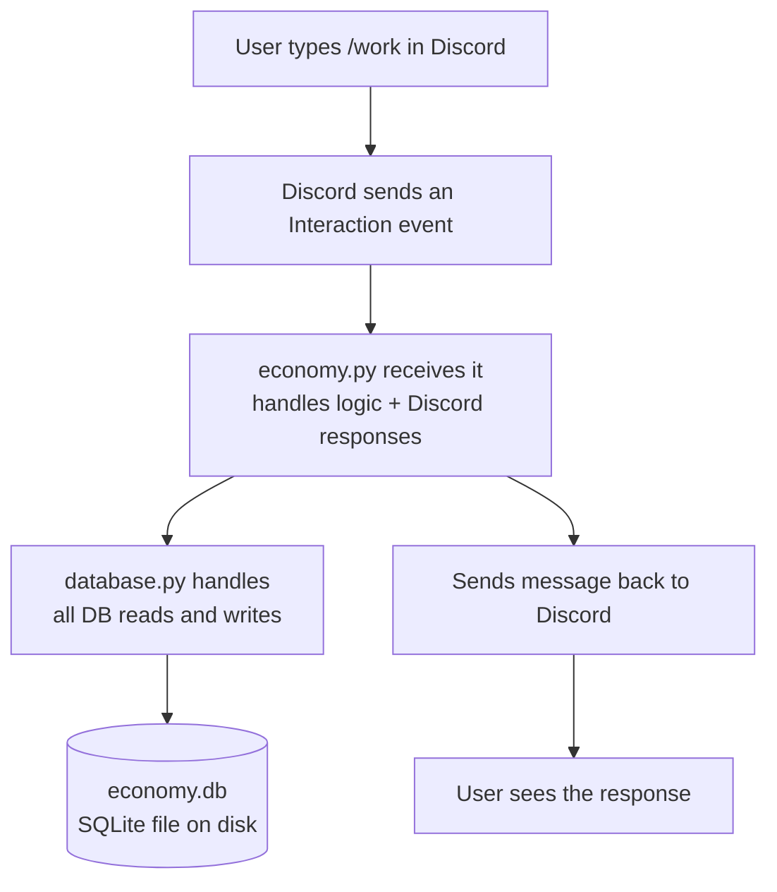
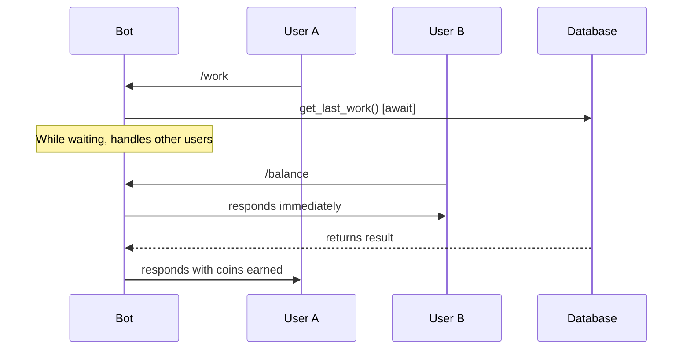

> **Core ideas behind how the bot works, not the code itself**
>  >
High-level ideas:
- Microservices prototype: split economy, auth, and game logic into small services with clear APIs (fastAPI + Docker + CI).
- Plugin/mod system: allow server owners to enable/disable modules; design plugin interface and hot-reloadable commands.
- End-to-end testing harness: simulate thousands of players with bots to validate balancing, race conditions, and DB integrity.
- Observability demo: telemetry (Prometheus/Grafana), structured logs, and incident playbooks from simulated failures.

*Ideas List*
- Multiple jobs
- Different work intervals/mechanics
- Titles
- Jail time for heists  [Added]
- fame/infamy system that triggers job changes
- Mini games for jobs (farming game/bank heist decision game)
- Pet system, maintained feeding and walking
- Different pet shops (maybe rotate)
- Breakout system (play risks jail time to break other players free)
	- Risk to be considered [Added]
- Bailout system

Graphing
- Sort Cog -> Database function tree.
	- Deep understanding of which functions currently interact w/ one another and which functions invoke database functions.

Current Step: Bank Robbery Implementation
- rob bank function in database done
- heist command function started
- heist jail system finished

- Working on patching jail break system, currently kinda working.

---

## The Big Picture



---

## Concept 1 — Separation of Concerns

The project is split into files on purpose. Each file has **one job** and doesn't do the other's job.

|File|Job|Talks To|
|---|---|---|
|`bot.py`|Starts the bot, loads everything|Discord API|
|`economy.py`|Handles commands, Discord responses|Discord + database.py|
|`database.py`|Reads and writes data|SQLite only|

**Restaurant analogy:**


- The waiter doesn't cook
- The kitchen doesn't talk to customers
- Each does its own job cleanly

---

## Concept 2 — Async / Await

### Why it exists

A bot serves many users at once. Without async, one slow database call would freeze the entire bot for everyone.



### The rule

```
If a function is defined with async def → you must call it with await
If a function waits on something external (DB, Discord API) → it needs async def + await
If a function is instant pure Python (math, random) → no await needed
```

### Examples

|Line|Needs await?|Why|
|---|---|---|
|`time.time()`|❌|Pure Python, instant|
|`random.randint(50, 200)`|❌|Pure Python, instant|
|`database.get_balance()`|✅|Reads from disk|
|`interaction.response.send_message()`|✅|Calls Discord's API|

---

## Concept 3 — SQLite and How Data is Stored

### What SQLite is

- A database that lives in a single **file** on disk (`economy.db`)
- No server needed, no setup — just a file
- You talk to it using **SQL** (Structured Query Language)

### The users table

```
┌─────────────────────────────────────────┐
│                 users                   │
├────────────┬───────────┬────────────────┤
│  user_id   │  balance  │   last_work    │
├────────────┼───────────┼────────────────┤
│ 1234567890 │    350    │   1716000000   │
│ 9876543210 │     0     │       0        │
└────────────┴───────────┴────────────────┘
```

- Each **row** = one Discord user
- Each **column** = one piece of data about them
- `user_id` is the PRIMARY KEY — no two rows can share one

### The 4 SQL operations you use

| Operation                            | What it does               | When used                          |
| ------------------------------------ | -------------------------- | ---------------------------------- |
| `CREATE TABLE IF NOT EXISTS`         | Makes the table on startup | `setup_db()`                       |
| `SELECT col FROM table WHERE ...`    | Reads a value              | `get_balance()`, `get_last_work()` |
| `INSERT OR IGNORE INTO ...`          | Creates a row if missing   | `add_balance()`, `set_last_work()` |
| `UPDATE table SET col = ? WHERE ...` | Changes a value            | `add_balance()`, `set_last_work()` |

### Why INSERT OR IGNORE before every UPDATE

You can't update a row that doesn't exist. So every write does two steps:

```
Step 1 → INSERT OR IGNORE  (create the row if missing, skip if already there)
Step 2 → UPDATE            (now safely write to the row)
```

---

## Concept 4 — When Users Enter the Database

Not every command creates a DB entry. This is intentional.

```mermaid
flowchart TD
    A[/balance used] --> B{User in DB?}
    B -->|Yes| C[Return their balance]
    B -->|No| D[Return 0\nno row created]

    E[/work used] --> F[INSERT OR IGNORE\ncreates row if missing]
    F --> G[UPDATE balance + coins]
    G --> H[UPDATE last_work timestamp]
```

- `/balance` → **read only**, never writes, never creates a row
- `/work` → **always writes**, creates the row on first use

---

## Concept 5 — The Cooldown System

### How Unix timestamps work

`time.time()` returns the number of **seconds since January 1, 1970**. It's always increasing.

```
Jan 1 1970       Now (approx)
│                │
0 ───────────────1,716,000,000
```

### Cooldown logic

```
now       = current timestamp  (e.g. 1000)
last      = when they worked   (e.g. 400)
elapsed   = now - last         = 600 seconds
cooldown  = 3600 seconds

600 < 3600 → still on cooldown
```

```
flowchart TD
    A[/work used] --> B[now = time.time]
    B --> C[last = get_last_work from DB]
    C --> D{now - last < 3600?}
    D -->|Yes - on cooldown| E[Show minutes remaining\nreturn early]
    D -->|No - cooldown expired| F[Earn random coins]
    F --> G[add_balance to DB]
    G --> H[set_last_work to now]
    H --> I[Show coins earned]
```

### Why store time as an integer

`time.time()` returns a float like `1716000000.453` — the decimal is meaningless for cooldowns measured in minutes, so you wrap it in `int()` to keep it clean.

---

## Concept 6 — Cogs

### What they are

A **Cog** is a class that groups related commands. Without cogs, all commands pile up in `bot.py`. With cogs, you split them into organized modules.

```
    A[bot.py] -->|loads| B[cogs/economy.py\nEconomy Cog]
    A -->|loads| C[cogs/moderation.py\nModeration Cog - future]
    A -->|loads| D[cogs/shop.py\nShop Cog - future]
    B --> E[/balance]
    B --> F[/work]
    C --> G[/ban]
    C --> H[/kick]
    D --> I[/buy]
    D --> J[/shop]
```

### Required pieces of a cog

```python
class Economy(commands.Cog):   # must inherit from commands.Cog
    def __init__(self, bot):   # receives the bot instance
        self.bot = bot         # stores it for later use

async def setup(bot):          # discord.py looks for this exact function
    await bot.add_cog(Economy(bot))
```

- Without `setup()` the cog won't load
- Without `commands.Cog` inheritance it won't register commands

---

## Concept 7 — Slash Commands vs Prefix Commands

||Prefix Commands|Slash Commands|
|---|---|---|
|Example|`!balance`|`/balance`|
|How triggered|Bot reads message content|Discord sends Interaction event|
|Registration|Automatic|Must call `tree.sync()`|
|Response|`ctx.send()`|`interaction.response.send_message()`|
|Decorator|`@commands.command()`|`@app_commands.command()`|

### Why sync matters

`tree.sync()` tells Discord's servers "here are my commands, show them in autocomplete." Without it, Discord doesn't know your commands exist. Global sync can take up to an hour — guild (server) sync is instant and better for development.

---

## Concept 8 — The ? Placeholder in SQL

**Never** put variables directly in SQL strings.

```python
# ❌ Dangerous - SQL injection risk
f"SELECT balance FROM users WHERE user_id = {user_id}"

# ✅ Safe - use placeholders
"SELECT balance FROM users WHERE user_id = ?", (user_id,)
```

The `?` is replaced safely by `aiosqlite` before the query runs. The tuple after the string provides the values in order — one `?` per value.

---

## What to Build Next

|Feature|New Concepts Introduced|
|---|---|
|`/pay @user amount`|Multi-row SQL updates, input validation|
|`/leaderboard`|`SELECT` with `ORDER BY`, multiple rows|
|`/shop`|Second DB table, `JOIN` statements|
|`/daily`|Same cooldown pattern as `/work`|
|`.env` token storage|`python-dotenv`, environment variables|